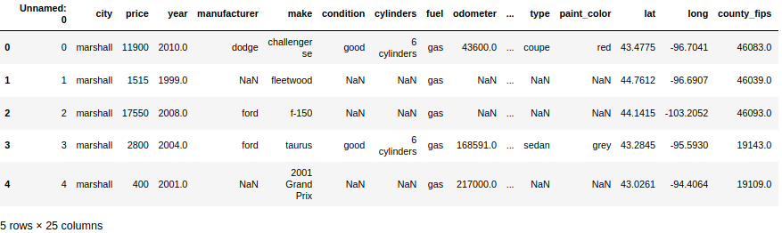
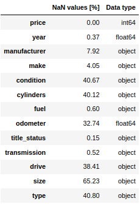
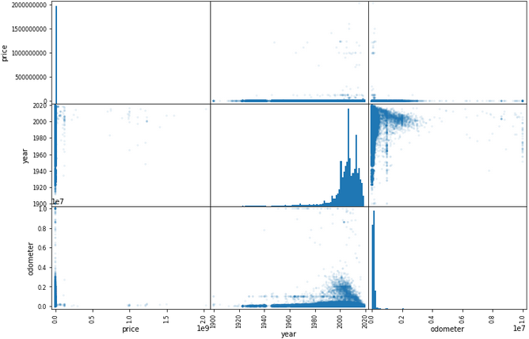
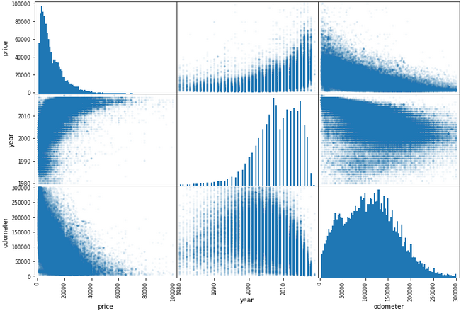
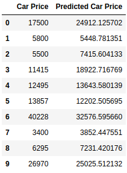
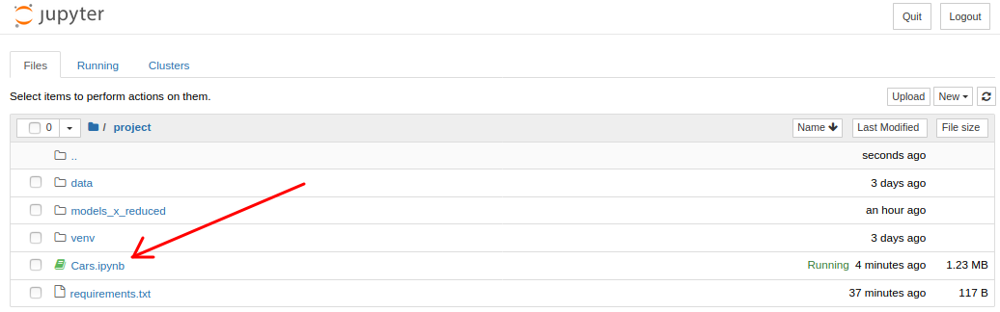
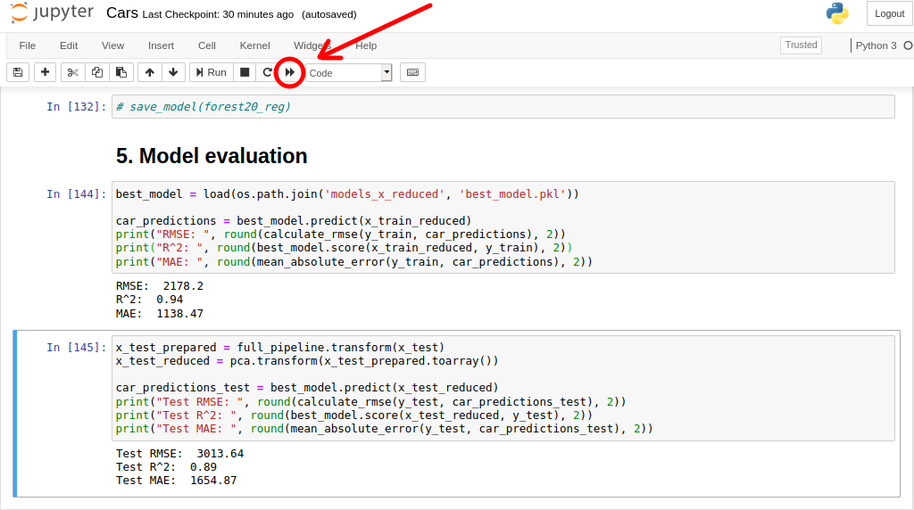

# Car price predictor

## Table of contents
* [General info](#general-info)
* [Stages of project](#stages-of-project)
* [Setup](#set-up)
*  [Project usage](#project-usage)
* [Technologies](#technologies)
* [Status](#status)

## General info
In Car price predictor project, I analyzed data set of cars in USA. This set contain a lot relevant information about cars, e.g. price, year, conditon or manufacturer.
The aim of the project was to create a machine learning alghoritm, which be able to predict the prices of cars. 

## Stages of project
0. [Loading data](#loading-data)
1. [Data cleaning](#data-cleaning)
2. [Splitting data](#spliting-data)
3. [Pipelines, dimensionality reduction](#pipelines-dimensionality-reduction)
4. [Model selections and tuning](#model-selections-and-tuning)
5. [Model evaluation](#model-evaluation)
### 0. Loading data
Cars data set is in CSV format. 
Using pandas, DataFrame object was created.
```python
import os
import pandas as pd

CARS_PATH = 'data'

def load_cars_data(cars_path=CARS_PATH):
    csv_path = os.path.join(cars_path, 'car_data.csv')
    return pd.read_csv(csv_path)

cars = load_cars_data()
cars.head()
```

### 1. Data cleaning
#### Unnecessary columns
After a preliminary analysis of the available features, it has been decided to drop unnecessary columns.
```python
col_to_drop = [
    'Unnamed: 0',
    'city',
    'vin',
    'paint_color',
    'lat',
    'long',
    'county_fips',
    'county_name',
    'state_fips',
    'state_code',
    'state_name',
    'weather',
]
cars = cars.drop(columns=col_to_drop)
```
The tabel below shows the percent of NaN values in rest of columns.



#### Dropped columns
Columns with too many NaN values were dropped:

-cylinders

-drive

-size

-type


#### Dropped rows
For attributes which seems to be important or had small amount of NaN values, rows were dropped:

-manufacturer

-make

-condition

-title_status
#### Numeric data cleaning
Scatter plot show that outlier values must be remove.



The following values have been dropped.

'price': values higher than 100000 and lower than 1000 

'odometer': values higher than 300000 and lower than 3000

'year': values lower than 1980

Scatter plot after numeric data cleaning.



#### 'Manufacturer' and 'make'

'Manufacturer' and 'make' were compared with data from library vehicle-makes, and incorrect were dropped. Makes which occurred more than 20 times were retained. 

### 2. Spliting data
Spliting car data to train(80%) and test set(20%)
```python
cars_train, cars_test = train_test_split(cars, test_size=0.2, random_state=42)
x_train = cars_train.drop(columns='price')
x_test = cars_test.drop(columns='price')
y_train = cars_train['price'].values
y_test = cars_test['price'].values
```
### 3. Pipelines, dimensionality reduction
##### Pipeline for numerical attributes:
* 'data_selector' - select numeric data,
* 'num_imputer' - fill NaN values with median of fitted data
* 'standard_scaler' - scaling values to one scale
```python
num_pipeline = Pipeline([
    ('data_selector', DataFrameSelector(num_attribs)),
    ('num_imputer', SimpleImputer(strategy='median')),
    ('standard_scaler', StandardScaler()),
])
```
##### Pipeline for categorical attributes
* 'data_selector' - select categorical data,
* 'cat_imputer' - fill NaN values with most frequent value of fitted data
* 'ordinal_encoder' - transform categorical variables to numeric values [0, n_unique_feature - 1]
* 'one_hot_encoder' - transform numeric values to sparse matrix

```python
cat_pipeline = Pipeline([
    ('data_selector', DataFrameSelector(cat_attribs)),
    ('cat_imputer', SimpleImputer(strategy='most_frequent')),
    ('ordinal_encoder', OrdinalEncoder()),
    ('one_hot_encoder', OneHotEncoder()),
])
```
##### FeatureUnion (concatenation of pipelines results)
```python
full_pipeline = FeatureUnion(transformer_list=[
    ('num_pipeline', num_pipeline),
    ('cat_pipeline', cat_pipeline),
])

x_train_prepared = full_pipeline.fit_transform(x_train, y_train)
```
##### Dimensionality reduction
Reduction of dimensionality by using the PCA algorithm will improve the performance of training process.
```python
pca = PCA(n_components=77, random_state=0)
x_train_reduced = pca.fit_transform(x_train_prepared.toarray())
```
```
Size of sampel before dimensionality reduction:  309
Size of sampel after dimensionality reduction:  77
```


### 4. Model selections and tuning
In this section, only training set was used for evaluation.
#### Trained linear models and their results:
 
 LinearRegression
```
RMSE:  5385.58
R^2 score:  0.66
MAE:  3577.51

Cross-validation RMSE:
Scores: [5347.57 5416.16 5399.67]
Mean:  5387.80
Std:  29.23
```
SGDRegressor
```
RMSE:  5386.3
R^2 score:  0.66
MAE:  3568.82

Cross-validation RMSE:
Scores: [5348.02 5417.27 5400.10]
Mean:  5388.46
Std:  29.44
```
Lasso
```
RMSE:  5386.07
R^2 score:  0.66
MAE:  3573.57

Cross-validation RMSE:
Scores: [5347.19 5416.99 5400.72]
Mean:  5388.30
Std:  29.82
```
LinearSVR
```
RMSE:  5615.65
R^2 score:  0.63
MAE:  3406.84

Cross-validation RMSE:
Scores: [5581.80 5659.22 5632.07]
Mean:  5624.36
Std:  32.07
```
For all linear algorithms, it can be observed underfitting. To solve this problem, a more powerful algorithm is needed.

#### DecisionTreeRegressor
```
RMSE:  528.07
R^2 score:  1.0
MAE:  116.0

Cross-validation RMSE:
Scores: [4219.60 4142.62 4138.5e]
Mean:  4166.91
Std:  37.29
```
RMSE for prediction based on training set is lower than cross-validation results. It means, model has been overfitted.
#### RandomForestRegressor
RandomForestRegressor(n_estimators=5)
```
RMSE:  1549.07
R^2 score:  0.97
MAE:  692.4

Cross-validation RMSE:
Scores: [3445.13 3493.65  3444.41]
Mean:  3461.06
Std:  23.04
```

RandomForestRegressor(n_estimators=10)
```
RMSE:  1389.16
R^2:  0.98
MAE:  659.23

Cross-validation RMSE:
Scores: [3301.00 3342.29 3321.56]
Mean:  3321.62
Std:  16.85
```
RandomForestRegressor(n_estimators=20)
```
RMSE:  1294.96
R^2:  0.98
MAE:  635.72

Cross-validation RMSE:
Scores: [3215.18 3262.36 3251.37]
Mean:  3242.97
Std:  20.16
```
Can be observed the same dependency, as for DecisionTree. But, in this case differnce between RMSE values is lower. 
The best model is RandomForestRegressor with parameter n_estimators=20. It will be regularized next.

####  Model tuning
##### Used parameters:
* max_depth
* min_samples_leaf

##### Used tool:
* GridSearchCV

GridSearchCV returns the best combination of given parameters.
```python
from sklearn.model_selection import GridSearchCV

grid_params = [
    {'min_samples_leaf': [5, 10], 'max_depth': [20, 30]}
]

grid_forest_reg = RandomForestRegressor(n_estimators=5, random_state=42)
grid_search = GridSearchCV(grid_forest_reg, grid_params, cv=3, scoring='neg_mean_squared_error')
grid_search.fit(x_train_reduced, y_train)
grid_search.best_params_
```
Output:
```
{'max_depth': 30, 'min_samples_leaf': 5}
```

### 5. Model evaluation
Using test set to assess the performance of RandomTreeRegressor.
```
Training set:
RMSE:  2183.65
R^2:  0.94
MAE:  1139.11
```
```
Test set:
Test RMSE:  3484.62
Test R^2:  0.86
Test MAE:  1943.76
```


Model of RandomForestRegressor predict satisfactory results, but it still be overfitted. To deal with it, can be used GridSearchCV with another parameters set.

## Set-up
#### Step 1.
Activate virtual enviroment 
```bash
source venv/bin/activate
```
#### Step 2.
Install libraries from file requirements.txt
```bash
pip3 install --upgrade jupyter matplotlib numpy pandas scikit-learn vehicle-makes
```
#### Step 3.
1. Open jupyter notebook
```
jupyter notebook
```
2. Open file Cars.ipynb


## Project usage 
To project path add folder with data named 'data', which contain CSV file named 'car_data.csv'.

Or rename parameters in first jupyter cell.

#### Test best model
To train and test my best model, click button shows bellow. 
At the end of notebook, You will see results of model evaluation .



#### Train your own model
If you want to train your own model, comment cells from section '5. Model evaluation' and in section '4. Model selections' add models which you want to train  and tune.

Addictionaly you could:
- test your model using cross-validation
- save your model

## Technologies
* Python - version 3.6.9
* jupyter - version 1.0.0
* scikit-learn - version 0.23.1


## Status
_in progress_

